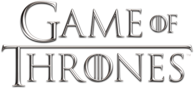

    

<h1 align="center"> Playlist </h1>

    <a href="#demo"> Demonstração</a> •
    <a href="#func"> Funcionalidade</a> •
    <a href="#tec"> Tecnologias</a> •
    <a href="#projeto"> Projeto</a> 
        

<h2 id="demo"> 📷 Demonstração </h2>

<h2 align="center">  </h2>
<h2 align="center">  </h2>

 

<h2 id="func"> ⚙ Funcionalidades </h2>

 - [x] Página totalmente responsiva  
 - [x] Notificações sobre vencedor e empate de jogos 
 - [x] Identificação de nomes nos inputs 
 - [x] Botão para iniciar novo jogo  
 - [x] Botão para resertar placares    

<h2 id="tec"> 🚀 Tecnologias </h2>

 Esse projeto foi desenvolvido com as seguintes tecnologias: 
 

✔️HTML  
✔️CSS  
✔️Javascript  

<h2 id="projeto"> 💻 Projeto </h2>

Tic-tac-toe(jogo da velha) criado com intuito de treinar tecnologias de HTML, CSS e Javascript. 
As regras dos jogo são: participam duas pessoas, que jogam alternadamente, preenchendo cada um dos espaços vazios. Cada participante deve usar um símbolo da casa Stark ou Bolton (lobo e X respectivamente). Vence o jogador que conseguir formar primeiro uma linha com três símbolos iguais, seja ela na horizontal, vertical ou diagonal. O campo de texto serve para colocar seu nome ou o nome da casa que desejar. 
A marca Game of Thrones foi usada com intuito de estudo.

 Criado por Lucas Freitas 🖖🏽| <a href="https://www.linkedin.com/in/lucasfreitas01/"> Faça contato comigo </a> 
 
